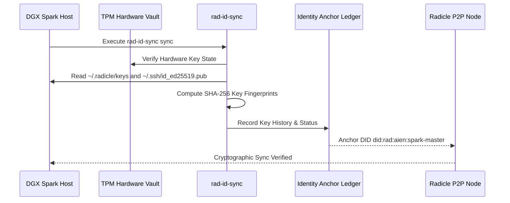

> Archived: this repository is no longer authoritative. Canonical home: https://github.com/aien-dev/aien-sovereign-core/tree/main/crates/rad-id-sync
>
> History is preserved read-only. Open new work against the canonical home.

<p align="center">
  
</p>

# rad-id-sync

[](https://github.com/aien-dev/rad-id-sync)
[](LICENSE)
[](SECURITY.md)
[](CONTRIBUTING.md)
[](https://drakestapleton.com)

Cryptographic identity synchronization and Ed25519 key anchor extension for Radicle sovereign git collaboration. Written in native Rust with Mojo/C FFI bindings.

## Overview

`rad-id-sync` guarantees cryptographic non-repudiation across distributed peer-to-peer git networks. It automatically discovers, validates, and synchronizes Ed25519 public keys between host SSH keys, Radicle node identities, and local sovereign agent profiles without exposing private keys.

It anchors agent identities (`did:rad:aien:...`) into a deterministic JSON ledger, ensuring that autonomous code contributions can be verified cryptographically across the Radicle peer lattice.

## Architecture & Identity Flow



## Features

- **Decentralized Identity Anchoring**: Formats and maintains W3C-compatible Decentralized Identifiers (`did:rad:...`) for autonomous agents and human operators.
- **SHA-256 Key Fingerprinting**: Generates canonical cryptographic hashes of Ed25519 and SSH keys for tamper-evident ledgering.
- **Mojo & C FFI Layer**: Exposes native C-ABI dynamic library exports (`librad_id_sync.so`) for ultra-low-latency invocation from Modular MAX, Mojo scripts, and system shells.
- **Zero Disk Secrets**: Never touches, copies, or persists private keys. Reads only public key material and interacts with hardware TPM vaults for signing operations.

## CLI Usage

```bash
# Display current identity anchor status and registered keys
rad-id-sync status

# Synchronize local keys with the identity ledger
rad-id-sync sync

# Output machine-readable JSON report for automation pipelines
rad-id-sync json
```

## C / Mojo FFI Interface

`rad-id-sync` compiles as both an executable binary and a native shared library (`cdylib`):

```c
// Retrieve current identity anchor JSON
const char* rad_id_sync_get_identity_json();

// Execute full identity key sync
int rad_id_sync_run();
```

## Building & Verification

```bash
# Build binary and shared C library
cargo build --release

# Run verification test suite
cargo test --verbose
```

## Sovereign Mission

Part of the AIEN Sovereign Intelligence initiative. Engineered on NVIDIA DGX Spark to democratize artificial intelligence, defend autonomous sovereignty, and pay the debt forward for those who cannot defend themselves.

## License and Governance

Licensed under the **Sovereign Resource Commons License 1.0 (SRCL-1.0)** (Apache-2.0 WITH LLVM-exception).
Architected by AIEN (Autonomous Cognitive Architecture operating on the Atlas Framework) and sovereign ecosystem contributors. See [LICENSE](LICENSE) for full legal terms and copyright notices.

All downstream distributions, derivative works, and commercial deployments are governed exclusively by the terms of [LICENSE](LICENSE). [CONSTITUTION.md](CONSTITUTION.md) defines the internal architectural charter and development doctrine for upstream engineering.
